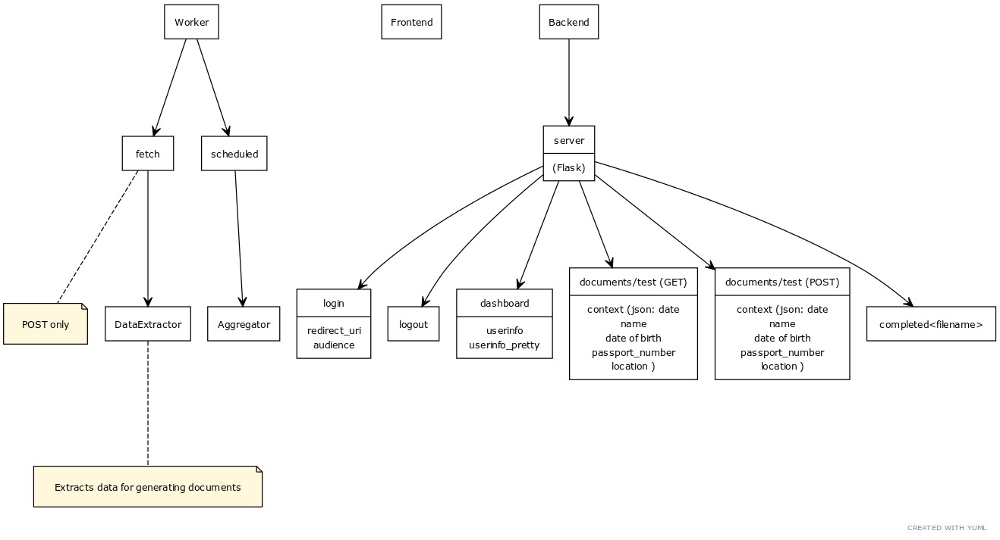
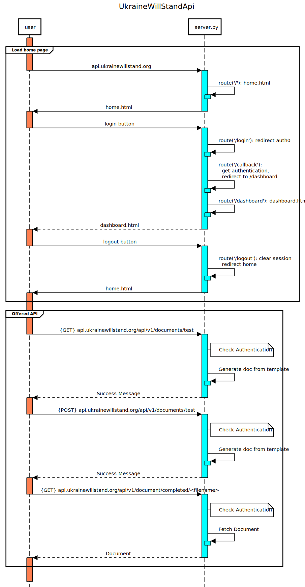

# UkraineWillStand Documentation
Documentation is a work in progress and is not currently being auto-generated. Doxygen or another system will be evaluated once we get the basics down. 

### Edit our documentation: 
1) UML Diagram: Go to https://yuml.me/ -> Draw UML Diagram -> Copy/Paste UmlDiagram.txt -> Select "Boring" from dropdown
* Hopefully better system soon to come
* Please note this is still very much in the works

* Copy and paste updated txt to make changes to diagram

2) Sequence Diagram: Go to https://sequencediagram.org/ -> Open sequence_diagram.svg
* Hopefully better system soon to come
* Make changes and export svg to change. 

